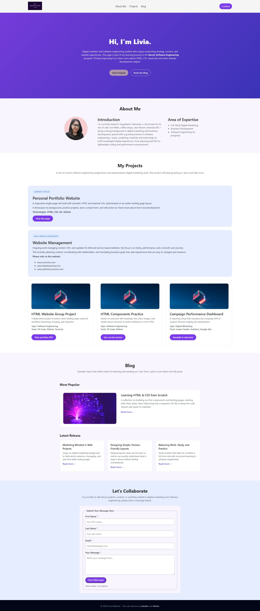

# Personal Portfolio – Module 2 Assignment

This is my updated personal portfolio for the RevoU Software Engineering program, Module 2.  
In this module, I refactored the original Module 1 landing page (previously styled with inline CSS) into a cleaner structure using an external CSS file, improved layout organization, and added responsive design for different screen sizes.

---

## How to View

**GitHub Pages:**  
https://revou-fsse-oct25.github.io/milestone-1-liviaoktantia/

---

## Overview of the Website

The portfolio is a single-page website containing:

- **Header & Navigation** – Logo text, navigation menu (About Me, Projects, Blog), and a Contact button.
- **Hero Section** – Title, short introduction, and two call-to-action buttons.
- **About Me Section** – Profile photo, introduction text, and an expertise list in a responsive grid layout.
- **Projects Section** – Featured projects and project cards with thumbnails, descriptions, and buttons.
- **Blog Section** – A large “Most Popular” card and three “Latest Release” cards.
- **Contact Section** – Contact form with fieldset, labels, required inputs, and helper text.
- **Footer** – Short copyright line and Social media links.

---

## Features Implemented (Module 2 – CSS)

### Styling Improvements
- Converted all inline CSS into a **separate `styles.css` file**.
- Added consistent typography, spacing, and color styling.
- Applied custom button designs with hover states.
- Designed card components for Projects and Blog sections with:
  - Rounded corners  
  - Soft borders  
  - Hover effects (purple border + subtle shadow + slight lift)

### Layout & Structure
- Implemented **CSS Grid** in:
  - About Me layout  
  - Project cards grid  
  - Blog cards layout  
- Used **Flexbox** for navigation bar alignment.

### Responsive Design
- Added media queries for:
  - **Tablets (max-width 1024px)** – reorganized About layout, project grid becomes 2 columns, blog adjusts to 2 columns.
  - **Mobile (max-width 768px)** – stacks layouts vertically, wraps navigation, reduces spacing, and ensures readability.
- Ensured images scale using `object-fit: cover`.
- Adjusted hero section and contact form spacing for smaller screens.

---

##  Technologies Used

- **HTML5**  
- **CSS3** (Flexbox, CSS Grid, Media Queries)  
- **GitHub** (for version control & deployment)

---

## Screenshots

---

## How to View

### Online (Recommended)
Visit the live GitHub Pages version:  
https://revou-fsse-oct25.github.io/milestone-1-liviaoktantia/

### Run Locally
Clone the repository:

Cmd:
git clone https://github.com/Revou-FSSE-Oct25/milestone-1-liviaoktantia.git
cd milestone-1-liviaoktantia
